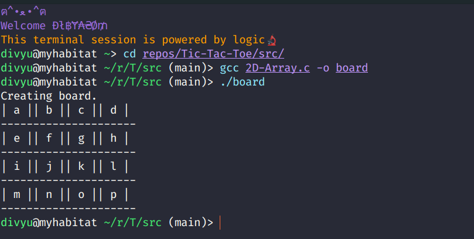

# :sparkles: Project Tictactoe :sparkles:

<br>

## Hey there, I'm Dibyasom, and here's How to make a CLI tic-tac-toe game.

### Before we begin, I'd like to tell you this,

<br>

> You've perfect knowledege of your shortcomings, and imperfect knowledge of their acievements, don't compare yourself yet.

<br>

### Ps.

Configure your workspace, If you're on<br>

- Linux, you're good to go just make sure `gcc` is intalled.
- Windows, you might wanna install `Dev C++`. It can execute C codes too.
- If the prev. 2 options bring you a frown, just go with `Online GDB`, code will be identical for every platform.

<br>

### **Wait what?**

Before getting hands dirty with coding, Let's think about the logic for a while, this will make the coding phase 10x simpler, and I'm not even exagerating.<br>

<br>
 
So, where do we store the data, like the current state of the board, and what data structure to use? <br><br>
_Well, here's the tic-tac-toe board plain and simple._

|     |     |     |
| --- | --- | --- |
| X   | X   | O   |
| X   | X   | O   |
| X   | X   | O   |

<br>

_Now, let's look at it with the perspective of a nerd. (Yes, welcome to the world. :rocket:)_

| Row 👇 / Col 👉 | 0   | 1   | 2   |
| --------------- | --- | --- | --- |
| **0**           | X   | O   | X   |
| **1**           | X   | O   | X   |
| **2**           | X   | O   | X   |

<br>

It's superevident right, we just need to take a matrix (2D array), and store 'X' or 'O' in respective locations, and that solves the data-structure pain.

<hr>

### Lets's write the code to create a 2D array.

###### Ps, these are fully-functional code snippets without main (), by the end of this tutorial you'll be connecting the dots (or should I say functions) and make your own version of the complete code. :heart:

We will be using `malloc()` to create our arrays, cause we will be spitting the 2D-array (I might be refering to this as Matrix a lot.) accross many functions, also using the classic array declaration way is kinda nightmare.

Syntax for malloc >

```C
<datatype>* <variableName> = (<datatype of array-elements>)malloc(sizeof(<datatype>)*numerOfElements);

// If I want to declare an array 'jamesBond' with three elements of type int, here's how.
int arrSize = 3;
int* jamesBond = (int*)malloc(sizeof(int)*arrSize);
```

<br>

```C
/*
 *  Returns n*n dynamically alloted array.
 *  This 2D array will be storing the state of the board.
 */

char** createBoard(int boardSize){

    // Create an array of character pointers, each pointer will represent a row.
    char **board = (char**)malloc(sizeof(char**)*boardSize);

    // Assign a row to each pointer in array.
    for(int i=0; i<boardSize; i++)
        board[i] = (char*)malloc(sizeof(char)*boardSize);

    // Return the freshly baked board.
    return board;
}
```

Having our array declared isn't enough right, let's put some user-friendly notation to refer to each block. The board should look something like,

| Row 👇 / Col 👉 | 0   | 1   | 2   |
| --------------- | --- | --- | --- |
| **0**           | A   | B   | C   |
| **1**           | D   | E   | F   |
| **2**           | G   | H   | I   |

Now the user can just drop a character to refer to any specific cell, easy-peasy?<br>Here's the code to do that.

```C
void labelBoard(char** board, int boardSize){
    char currLabel = 'A'; // Label for cell (0,0)
                          // Rest will follow.
    // Loop and label.
    for(int i=0; i<boardSize; i++)
        for(int j=0; j<boardSize; j++)
            board[i][j] = currLabel++;
}
```

Since we're at it let's also write the code to print the board.

```C
void displayBoard(char** board, int boardSize){
    system("clear"); printf("\n\n"); //Clear stdout, and leave 2 lines.

    int unitSize;
    for(int i=0; i<boardSize; i++){
        for(int j=0; j<boardSize; j++){
            if(j<boardSize-1)
                unitSize = printf(" %c |", board[i][j]); //unitSize now holds length of string printed.
            else
                unitSize = printf(" %c ", board[i][j]);
        }
        printf("\n");

        if(i < boardSize-1)
            for(int k=0; k<=unitSize*boardSize; k++) //Printing unitSize no. of '-' makes sure
                                                     // The entire row is being covered.
                printf("-");

        printf("\n");
    }
    printf("\n");
}
```

> Output of these functions combined.
> 

<br>

Let's write one last utility function, which returns an array of playerNames.

```C
char** fetchPlayerIds(){
    char** playerNames = (char**)malloc(sizeof(char**)*2);

    for(int i=0; i<2; i++){
        playerNames[i] = (char*)malloc(sizeof(char)*30);
        printf("Player %d > ", (i+1));
        scanf("\n");
        scanf("%[^\n]%*c", playerNames[i]);
    }

    return playerNames;
}
```

<br>

Having done that, we just figured out 30% of the project, Kudos!

<hr>

<br>

## Well the logic is really straightforward.

- [x] Create a 2d array of size 3\*3. {More on this later}
- [x] Fill those with a to (a+9).
- [ ] Loop begins.
  - [ ] Fetch an user input whichever cell.
  - [ ] Update the cell with appropriate value accoring to player's number.
  - [ ] Check for win-condition.
  - [ ] If win-condition is satisfied >
    - [ ] Display winner, exit.
    - [ ] else, continue.
