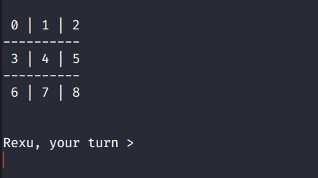

# :sparkles: Project Tictactoe :sparkles:

<br>

## Hey there, I'm Dibyasom, and here's How to make a CLI tic-tac-toe game :heart: .


### Before we begin, I'd like to tell you this,

<br>

> You've perfect knowledege of your shortcomings, and imperfect knowledge of their acievements, don't compare yourself yet.

<br>

### Ps.

Configure your workspace, If you're on<br>

- Linux, you're good to go just make sure `gcc` is intalled.
- Windows, you might wanna install `Dev C++`. It can execute C codes too.
- If the prev. 2 options bring you a frown, just go with `Online GDB`, code will be identical for every platform.

<br>

### **Wait what?**

Before getting hands dirty with coding, Let's think about the logic for a while, this will make the coding phase 10x simpler, and I'm not even exagerating.<br>

<br>
 
So, where do we store the data, like the current state of the board, and what data structure to use? <br><br>
_Well, here's the tic-tac-toe board plain and simple._

|     |     |     |
| --- | --- | --- |
| X   | X   | O   |
| X   | X   | O   |
| X   | X   | O   |

<br>

_Now, let's look at it with the perspective of a nerd. (Yes, welcome to the world. :rocket:)_

| Row 👇 / Col 👉 | 0   | 1   | 2   |
| --------------- | --- | --- | --- |
| **0**           | X   | O   | X   |
| **1**           | X   | O   | X   |
| **2**           | X   | O   | X   |

<br>

It's superevident right, we just need to take a matrix (2D array), and store 'X' or 'O' in respective locations, and that solves the data-structure pain.

<hr>

### Lets's write the code to create a 2D array.

###### Ps, these are fully-functional code snippets without main (), by the end of this tutorial you'll be connecting the dots (or should I say functions) and make your own version of the complete code. :heart:

We will be using `new` to create our arrays, cause we will be spitting the 2D-array (I might be refering to this as Matrix a lot.) accross many functions, also using the classic array declaration way is kinda nightmare.

Syntax for malloc >

```C++
<datatype>* <variableName> = new <datatype>[size];

// If I want to declare an array 'jamesBond' with three elements of type int, here's how.
int arrSize = 3;
int* jamesBond = new int[3];
```

<br>

### Let's complicate things a bit,

Now Imagine a situation where you have `multiple arrays, being used collectively for one goal`, For instance in tictactoe board, <br>

- You could take three separate arrays, denoting each row of the board, and somehow manage those (which would be a nightmare) to represent your board, it's possible but a bad way to do it.
- Better way exists? Yes ! _*YAYY*_ !!:sparkles: <br> - Make 3 separate arrays. - Make another array which stores pointers to these arrays. - That way you can manage all the three arrays, using a single variable.(Pointer type).
  <br>

### Same stuff, in SUPER SIMPLE TERMS> :brain:

If this doesn't make sense, look at the code snippet below. <br>

- I've created a `pointer-to-pointer` type array (names `board`), (Basically every element of this array will be pointer type, and hence the `**`. :rocket:)
- Then I loop through all the elements of `board`, and use malloc to assign each of these elements an address to an array. <br>
- TADAAA, Just by using `board` variable, I can access any element of any array assigned to it. - For instance, if I want 2nd element of 3rd array, I just have to use, <br>
  `C char val = board[2][1]; //3rd row, 2nd element. `
  <br>

```C++
/*
 *  Returns n*n dynamically alloted array.
 *  This 2D array will be storing the state of the board.
 */

char **createBoard(int boardSize)
{
    // Returns n*n dynamically alloted array.
    // This 2D array will be storing the state of the board.

    // Create an array of character pointers, each pointer will represent a row.
    char **board = new char *[boardSize];

    // Assign a row to each pointer in array.
    for (int i = 0; i < boardSize; i++)
        board[i] = new char[boardSize];

    // Return the freshly baked board.
    return board;
}

```

Having our array declared isn't enough right, let's put some user-friendly notation to refer to each block. The board should look something like,

| Row 👇 / Col 👉 | 0   | 1   | 2   |
| --------------- | --- | --- | --- |
| **0**           | 0   | 1   | 2   |
| **1**           | 3   | 4   | 5   |
| **2**           | 6   | 7   | 8   |

Now the user can just drop a number to refer to any specific cell, easy-peasy?<br>Here's the code to do that.

```C++
void labelBoard(char** board, int boardSize){
    char currLabel = '0';

    for(int i=0; i<boardSize; i++)
        for(int j=0; j<boardSize; j++)
            board[i][j] = currLabel++;
}
```

Since we're at it let's also write the code to print the board.

```C++
void displayBoard(char** board, int boardSize){
    system("clear"); printf("\n\n");

    int unitSize = 4*boardSize;
    for(int i=0; i<boardSize; i++){
        for(int j=0; j<boardSize; j++){
            if(j<boardSize-1)
                cout << " " << board[i][j] << " |";
            else
                cout << " " << board[i][j] << " ";
        }
        cout << endl;

        if(i < boardSize-1)
            for(int k=0; k<=unitSize*boardSize; k++)
                cout << "-";

        cout << endl;
    }
    cout << endl;
}
```

> Output of these functions combined.
> 

<br>

Having done that, we just figured out 30% of the project, Kudos!

<hr>

<br>

## Well the logic is really straightforward.

- [x] Create a 2d array of size 3\*3. {More on this later}
- [x] Fill those with a to (a+9).
- [ ] Loop begins.
  - [ ] Fetch an user input whichever cell.
  - [ ] Update the cell with appropriate value accoring to player's number.
  - [ ] Check for win-condition.
  - [ ] If win-condition is satisfied >
    - [ ] Display winner, exit.
    - [ ] else, continue.

<br>

### let's start with the loop.

In simple terms, The game should run till Either player wins, or there's a draw. <br>
Hence, we're gonna use a while loop, and break (up is silent :wink:) when any of above written condition occurs. <br>

> Here's the code for that. :heart:

```C++
void runGame(char** board, int boardSize, char** playerIds){
    char weapon[] = {'X', 'O'};
    int playerTurn = 0, rounds = 0;

     displayBoard(board, boardSize); //Display current state.

    while(rounds < 9){
        playerTurn = (playerTurn) ?0 :1;
        /*
        It's called TERNARY OPERATOR (Signified by ?,: operators.), same as writing ...

        if(playerTurn==1)
            playerTurn = 0;
        else
            playerTurn = 1;
        */

       // Fetch user's move.
       int X,Y;
       printf("%s, your turn > \n", playerIds[playerTurn]);
       choiceToCoordinates(&X, &Y, boardSize);
        //    Keep asking till a valid input is achieved.
       while(board[X][Y]=='X' || board[X][Y]=='O'){ //Check for range too.
           printf("It's occupied blindy. Go again, new choice? \n");
           choiceToCoordinates(&X, &Y, boardSize);
       }
       board[X][Y] = weapon[playerTurn]; // Update board.
       displayBoard(board, boardSize); //Display current state.

       // Check if someone has won already, continuing further won't make any sense now.
       int winner = checkWinCondition(board, boardSize, playerTurn);
       if(winner != -1){
           printf("%s wins, bow down yall. <3\n", playerIds[winner]);
           exit(0);
       }

       rounds++;
    }
}
```

<br>

Okay so there're a few new terms like, `playerIds` here? Woah!? What's that? <br>
It's just another utility function to make the game kinda interactive.

Code for fetching `playerIds`.

```C++
/*Returns a string array, of size 2, having names of players.*/
char** fetchPlayerIds(){
    char** playerNames = new char*[2];

    for(int i=0; i<2; i++){
        playerNames[i] = new char[30];
        cout << "Player " << (i+1) << " > ";
        cin >> playerNames[i];
    }

    return playerNames;
}
```

<br>

`choiceToCoordinates` sounds new too right? <br>
It basically maps the choice entered (A random digit b/w 0 and 8 (inclusive)) to the specific cell in board that digigt refers to. :rocket: <br>
Scroll up to see the mapping.

> here's the code for `choiceToCoordinates`

```C++
void choiceToCoordinates(int *x, int *y, int boardSize){
       scanf("\n");
       int choice; scanf("%d", &choice);

       *x = choice / boardSize;
       *y = choice % boardSize;
}
```

<br>

### Crucial of HIGHEST ORDER!

This is the actuall stuff, the algo that keeps check of the win condition, <br>
8 conditions have to be checked, 3 rows, 3 columns, and 2 diagonals.

> Here's the code for that.

```C++
int checkWinCondition(char** board, int boardSize, int playerTurn){
    for(int i=0; i<boardSize; i++){
        char rowVal = board[i][0]; int rowMatch=0;
        char colVal = board[0][i]; int colMatch=0;
        for(int j=0; j<boardSize; j++){
            if(board[i][j] == rowVal)
                rowMatch++;
            if(board[j][i] == colVal)
                colMatch++;
        }
        if(rowMatch==3 || colMatch==3)
            return playerTurn;
    }
    char leftD = board[0][0]; int leftDcount= 1;
    char rightD = board[boardSize-1][boardSize-1]; int rightDcount= 1;
    for(int i=1; i<boardSize; i++){
        if(board[i][i] == leftD)
            leftDcount++;
        if(board[boardSize-1-i][i] == rightD)
            rightDcount++;
    }
    if(leftDcount==3 || rightDcount==3)
        return playerTurn;
    return -1;
}
```

<br>

### Driver Function

Having come to this point, you have all the working pieces of the code, all you need to do, is create a main() and call all the functions in correct order, (or make more functions and make a better version :muscle:), Well I leave that to you guys.

> Here's my main().

```C++
int main(void){

    cout << "\n\n\tWelcome to GTA-VI\t<Fake Rockstar Logo <3\n\n";
    int boardSize;
    cout << "Boardsize: "; cin >> boardSize; 
    cout << "Creating board...\n\n";/**/
    char** board = createBoard(boardSize);
    labelBoard(board, boardSize);

    char** playerIds = fetchPlayerIds();
    runGame(board, boardSize, playerIds);
    free(board);


    return 0;
}
```

### Caution

Incase you run into error, it's probably because of missing function prototypes. <br>

Just add this below library inclusion statements.

```C++
void displayBoard(char**, int);
void choiceToCoordinates(int*, int*, int);
int checkWinCondition(char**, int, int);
```

<br>

Congo, for staying this long, and we just completed our miniproject. :sparkles:<br>

> **IF THIS TUTORIAL HELPED YOU, DO STAR THIS REPOSITORY, Would make my day** :heart:
